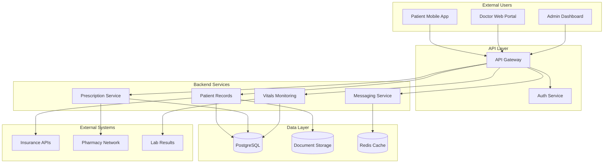

# Solaris Care Connect 360 Architecture

```mermaid
flowchart TB
    subgraph "External Users"
        Patient[Patient Mobile App]
        Doctor[Doctor Web Portal]
        Admin[Admin Dashboard]
    end

    subgraph "API Layer"
        GW[API Gateway]
        Auth[Auth Service]
    end

    subgraph "Backend Services"
        PR[Patient Records]
        RX[Prescription Service]
        MSG[Messaging Service]
        VITAL[Vitals Monitoring]
    end

    subgraph "Data Layer"
        DB[(PostgreSQL)]
        S3[(Document Storage)]
        REDIS[(Redis Cache)]
    end

    subgraph "External Systems"
        INS[Insurance APIs]
        PHARM[Pharmacy Network]
        LAB[Lab Results]
    end

    Patient --> GW
    Doctor --> GW
    Admin --> GW
    GW --> Auth
    GW --> PR
    GW --> RX
    GW --> MSG
    GW --> VITAL
    PR --> DB
    PR --> S3
    RX --> DB
    MSG --> REDIS
    VITAL --> DB
    RX --> PHARM
    PR --> INS
    VITAL --> LAB
```
