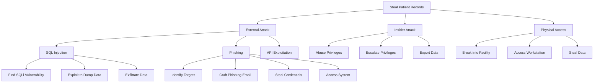

# Attack Trees - Solaris Care Connect 360

## Goal: Steal Patient Records

## Easiest Path Analysis

| Path | Steps | Difficulty | Detection Risk |
|------|-------|------------|----------------|
| SQL Injection | 3 | Medium | Low (if no WAF) |
| Phishing | 4 | Low | Medium |
| Insider | 3 | Low | High (if monitored) |
| Physical | 3 | High | High |

**Most Likely Attack**: Phishing (low difficulty, medium detection)
**Highest Impact**: SQL Injection (can dump entire database)

## Mitigation Priority

Focus controls on the easiest paths:
1. Security awareness training (blocks phishing)
2. WAF and input validation (blocks SQLi)
3. Privileged access monitoring (detects insider)
