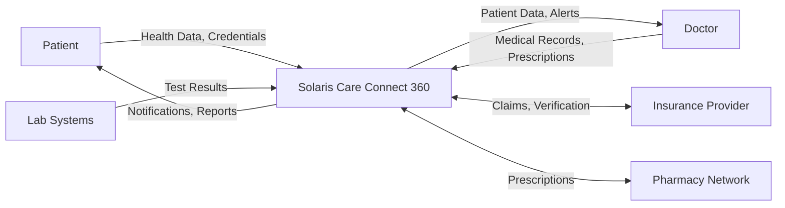

# Level 0 Data Flow Diagram

## External Entities
- **Patients**: End users accessing health data
- **Doctors**: Healthcare providers
- **Insurance**: Claims processing
- **Pharmacies**: Prescription fulfillment
- **Labs**: Test result delivery
