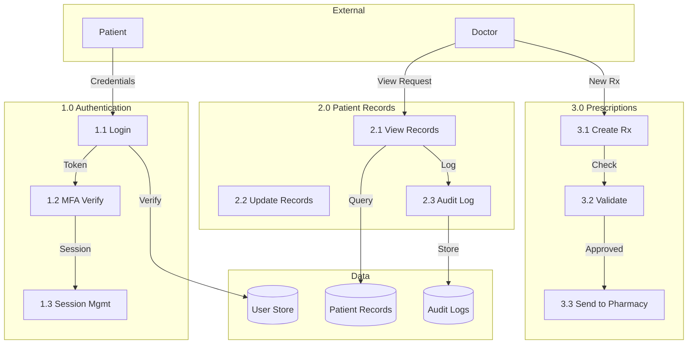

# Level 1 Data Flow Diagram

| Data Type | Classification | Encryption Required | Logging Required |
|-----------|---------------|---------------------|------------------|
| Patient Records | PHI - Critical | Yes (AES-256) | Yes - Full |
| Login Credentials | PII - High | Yes (bcrypt) | Yes - Access |
| Session Tokens | Sensitive | Yes (JWT signed) | Yes - Access |
| Audit Logs | Internal | Yes (at rest) | N/A |

