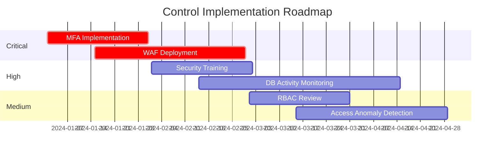

# Security Control Mapping - Solaris Care Connect 360

## Control Mapping Matrix

| Risk ID | Risk | Control Type | Control | NIST CSF | Status |
|---------|------|--------------|---------|----------|--------|
| I1 | SQL Injection | Preventive | Prepared statements, input validation | PR.DS-2 | Partial |
| I1 | SQL Injection | Preventive | Web Application Firewall | PR.PT-4 | Missing |
| I1 | SQL Injection | Detective | Database activity monitoring | DE.CM-3 | Missing |
| S1 | Credential Phishing | Preventive | Multi-factor Authentication | PR.AC-7 | Partial |
| S1 | Credential Phishing | Preventive | Security awareness training | PR.AT-1 | Missing |
| S1 | Credential Phishing | Detective | Email security gateway | DE.CM-1 | Implemented |
| E3 | SQLi to DBA | Preventive | Least privilege database accounts | PR.AC-4 | Missing |
| E3 | SQLi to DBA | Detective | Privileged access monitoring | DE.CM-3 | Missing |
| E1 | Privilege Escalation | Preventive | Role-based access control | PR.AC-4 | Partial |
| E1 | Privilege Escalation | Detective | Access anomaly detection | DE.AE-1 | Missing |

## Gap Analysis

### Critical Gaps (Missing Controls for Critical Risks)

| Gap | Risk | Impact | Recommended Control | Effort |
|-----|------|--------|---------------------|--------|
| GAP-1 | I1 | SQLi data breach | WAF deployment | Medium |
| GAP-2 | I1 | SQLi data breach | Database activity monitoring | High |
| GAP-3 | S1 | Credential theft | MFA for all users | Medium |
| GAP-4 | S1 | Credential theft | Security awareness program | Low |
| GAP-5 | E3 | DBA escalation | Database privilege review | Low |

## Recommended Control Implementation Priority

