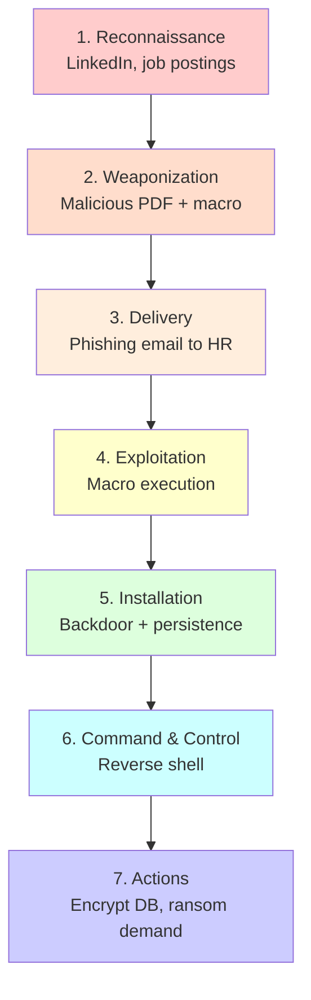
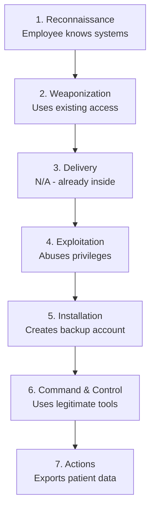

# Kill Chain Analysis - Solaris Care Connect 360

## Scenario 1: Ransomware Attack

### Detection Opportunities

| Stage | Detection Method | Tool/Control |
|-------|-----------------|--------------|
| Reconnaissance | Monitor for data scraping | OSINT monitoring |
| Delivery | Email filtering | Email gateway, sandbox |
| Exploitation | Endpoint detection | EDR, application whitelisting |
| Installation | File integrity monitoring | HIDS, FIM |
| C2 | Network monitoring | NDR, DNS analysis |
| Actions | Database activity monitoring | DAM, DLP |

### Breaking the Chain

The earlier you detect, the better. Focus on:
- **Left of Boom**: Recon, Delivery (prevention)
- **Right of Boom**: Installation, C2, Actions (detection/response)

## Scenario 2: Insider Threat

### Insider-Specific Controls
- User behavior analytics (UBA)
- Data Loss Prevention (DLP)
- Privileged Access Management (PAM)
- Regular access reviews
