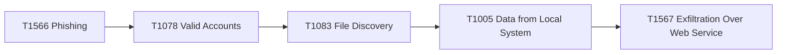

# MITRE ATT&CK Mapping - Solaris Care Connect 360

## Threat to Technique Mapping

| STRIDE ID | Threat | ATT&CK Technique | Tactic | Mitigation |
|-----------|--------|------------------|--------|------------|
| S1 | Credential Theft | T1566.001 Spearphishing Attachment | Initial Access | Security Awareness Training, Email Filtering |
| S2 | Fake Doctor Accounts | T1136.001 Local Account | Persistence | Account Monitoring, MFA |
| S3 | Token Forgery | T1528 Steal Application Access Token | Credential Access | Token Validation, Short Expiry |
| I1 | SQL Injection | T1190 Exploit Public-Facing App | Initial Access | Input Validation, WAF, Prepared Statements |
| E1 | Privilege Escalation | T1078 Valid Accounts | Privilege Escalation | RBAC, Least Privilege |
| E3 | SQLi to DBA | T1505.001 SQL Stored Procedures | Persistence | DB Hardening, Least Privilege |

## Attack Chain Example: Healthcare Data Breach

## Recommended Mitigations by Tactic

### Initial Access
- M1017: User Training
- M1031: Network Intrusion Prevention
- M1050: Exploit Protection

### Persistence
- M1032: Multi-factor Authentication
- M1026: Privileged Account Management
- M1018: User Account Management

### Exfiltration
- M1057: Data Loss Prevention
- M1037: Filter Network Traffic
- M1041: Encrypt Sensitive Information
