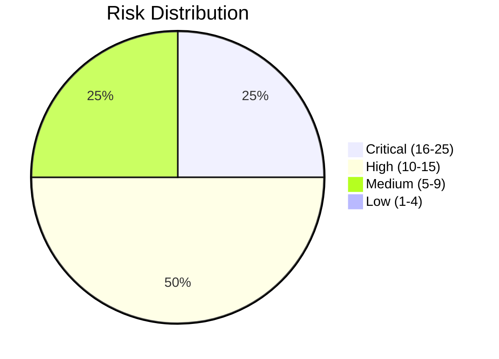

# Risk Register - Solaris Care Connect 360

## Risk Matrix

|   | Impact 1 | Impact 2 | Impact 3 | Impact 4 | Impact 5 |
|---|----------|----------|----------|----------|----------|
| **Likelihood 5** | 5 (Med) | 10 (High) | 15 (High) | 20 (Crit) | 25 (Crit) |
| **Likelihood 4** | 4 (Low) | 8 (Med) | 12 (High) | 16 (Crit) | 20 (Crit) |
| **Likelihood 3** | 3 (Low) | 6 (Med) | 9 (Med) | 12 (High) | 15 (High) |
| **Likelihood 2** | 2 (Low) | 4 (Low) | 6 (Med) | 8 (Med) | 10 (High) |
| **Likelihood 1** | 1 (Low) | 2 (Low) | 3 (Low) | 4 (Low) | 5 (Med) |

## Scored Threats

| ID | Threat | Likelihood | Impact | Risk Score | Priority |
|----|--------|------------|--------|------------|----------|
| I1 | SQL Injection - Data Breach | 4 | 5 | 20 | Critical |
| E3 | SQLi to DBA Access | 3 | 5 | 15 | High |
| S1 | Credential Phishing | 4 | 4 | 16 | Critical |
| T2 | Prescription Tampering | 2 | 5 | 10 | High |
| E1 | Patient to Doctor Escalation | 3 | 4 | 12 | High |
| D1 | DDoS Attack | 3 | 3 | 9 | Medium |
| I2 | Excessive Data Return | 4 | 3 | 12 | High |
| R1 | Prescription Denial | 2 | 3 | 6 | Medium |

## Top 5 Risks (Prioritized)

1. **SQL Injection (I1)** - Score: 20/25 - Immediate action required
2. **Credential Phishing (S1)** - Score: 16/25 - Implement MFA urgently
3. **SQLi to DBA (E3)** - Score: 15/25 - Database hardening needed
4. **Excessive Data (I2)** - Score: 12/25 - API review required
5. **Privilege Escalation (E1)** - Score: 12/25 - RBAC audit needed

## Risk Trend

